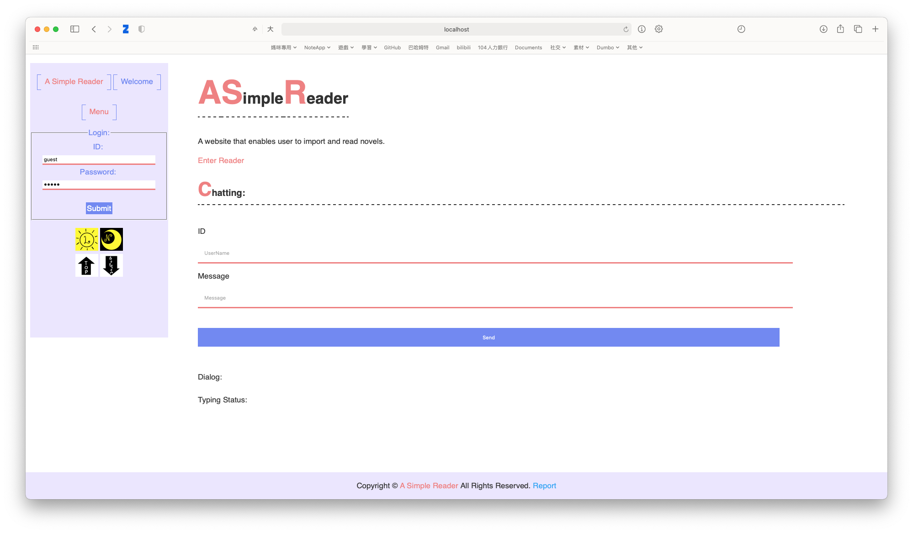
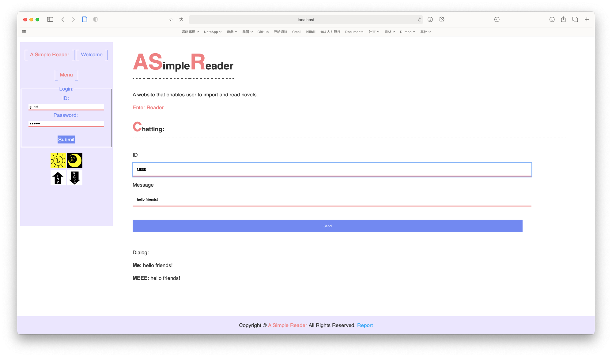
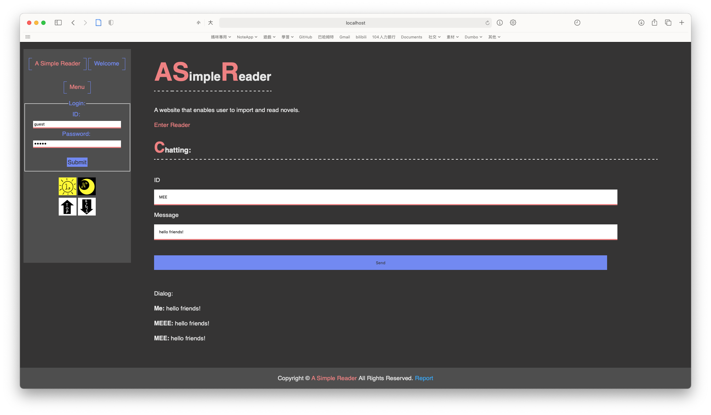
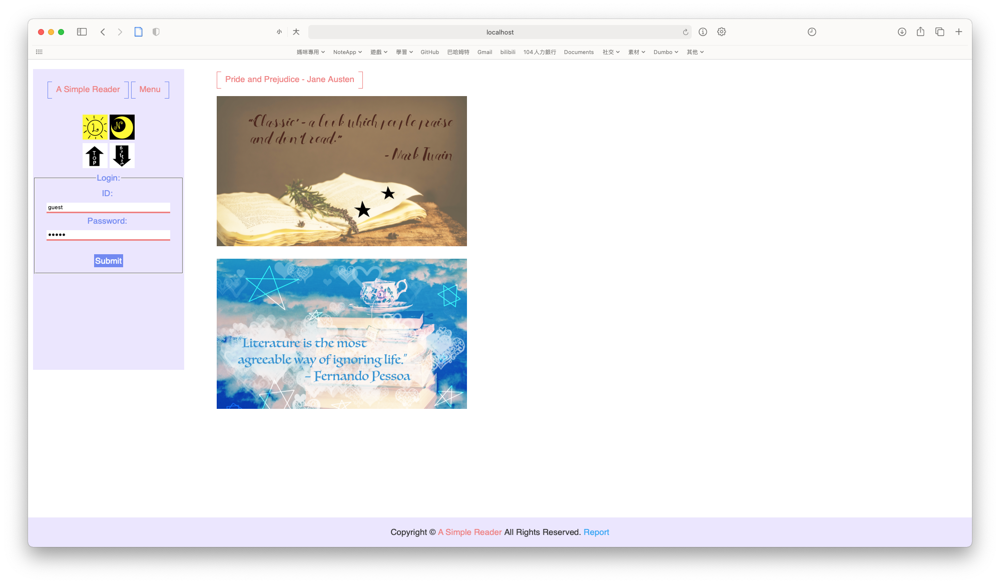
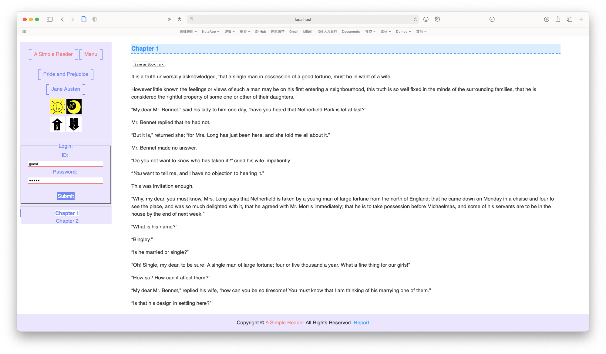
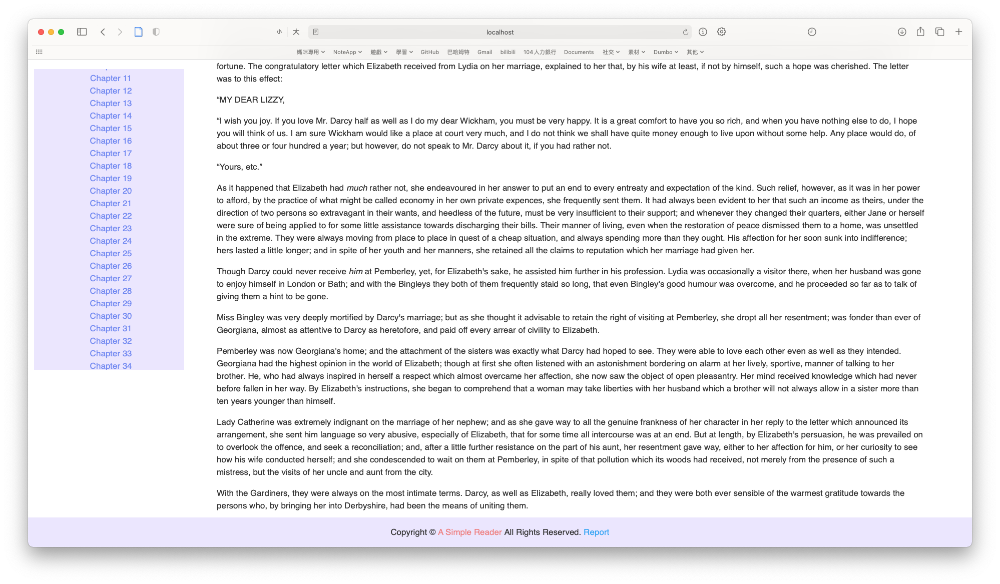
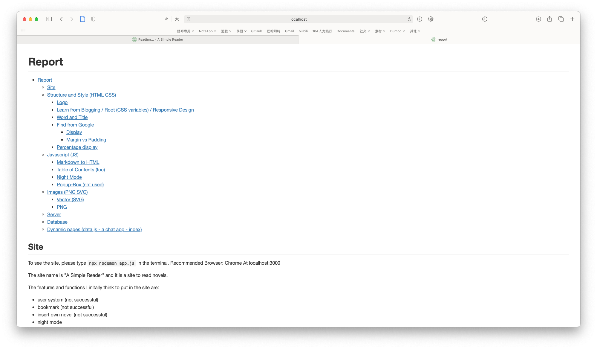

# Instructions

## Do These to See the Website

1. Install Node.js (LTS) (https://nodejs.org/)
2. Type and Run `npm install` in terminal
    Packages:
    ├── body-parser@1.19.0
    ├── express-force-ssl@0.3.2
    ├── express-generator@4.16.1
    ├── express@4.17.1
    ├── knex@0.16.5
    ├── marked@0.6.2
    ├── nodemon@1.19.1
    ├── npm-check-updates@3.1.9
    ├── socket.io@2.2.0
    └── sqlite3@4.0.8
3. Type and Run `cd site` in terminal
4. Type and Run `npx nodemon app.js` in terminal
5. Terminal will show:

    ```shell
    [nodemon] 1.19.4
    [nodemon] to restart at any time, enter `rs`
    [nodemon] watching dir(s): *.*
    [nodemon] watching extensions: js,mjs,json
    [nodemon] starting `node app.js`
    Listening at http://localhost:3000
    ```

6. Open Chrome or other browser and go to `http://localhost:3000` or the link terminal shows
7. To stop website running press `Ctrl + C` on Terminal

## Preview









